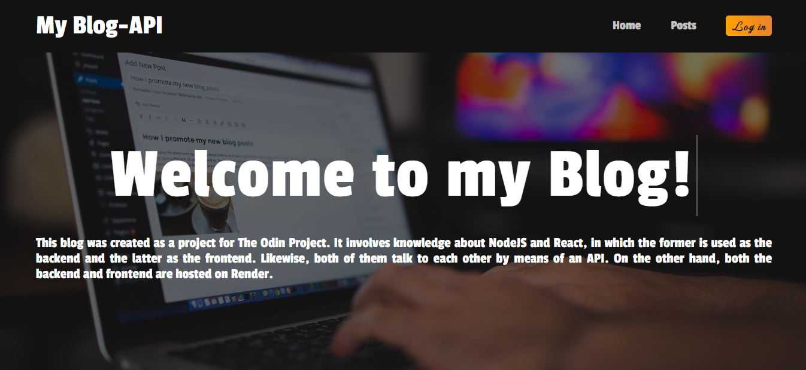
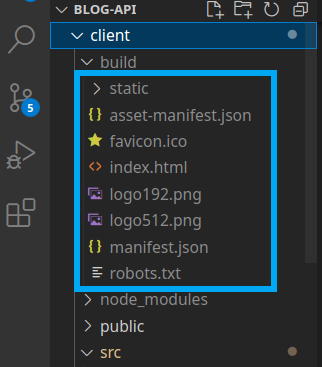
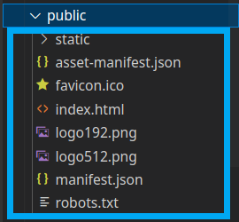
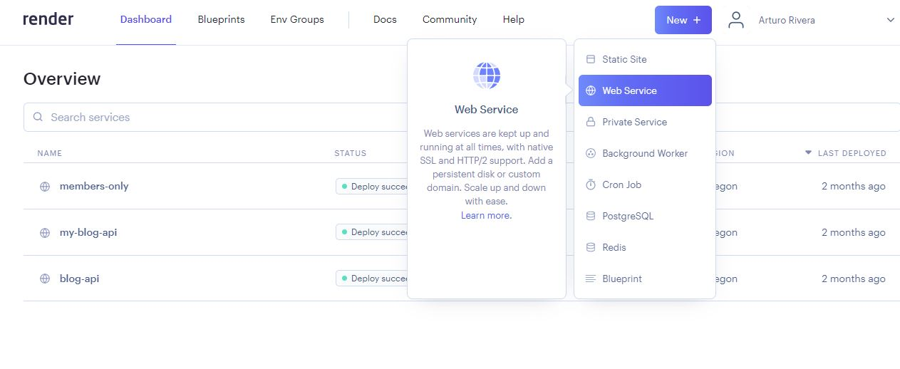
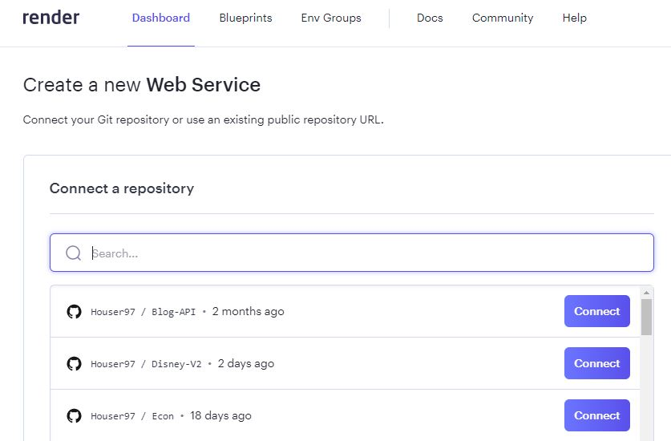
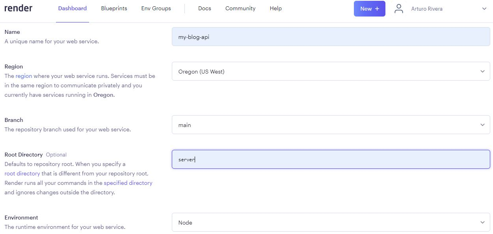
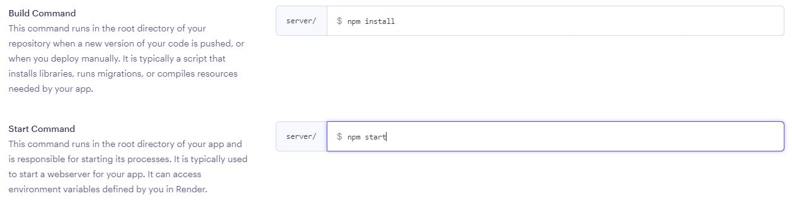
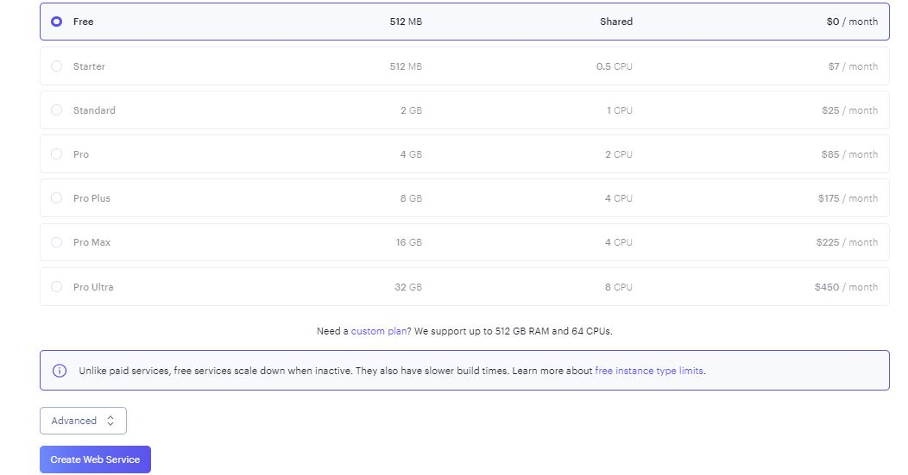
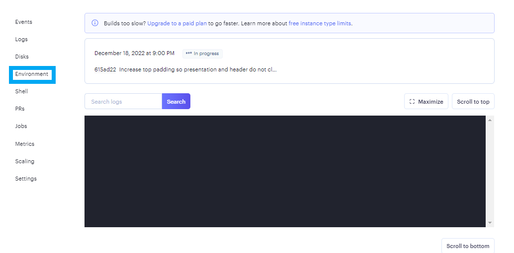
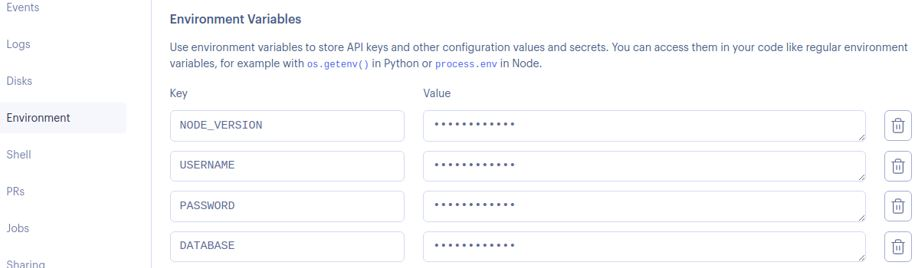

# REST API Blog using MERN Stack and JWT as means of authentication

## An example project that leverages MERN Stack, JWT autentication and deployment in Render



Project live preview: https://my-blog-api.onrender.com/

This project arose as an assignment along the curriculum provided by the site [The Odin Project](https://www.theodinproject.com/), where the main interest of the application is to implement a REST API to communicate the client (React) and the server (Express). Also, the application employs JWT (JsonWebToken) to provide the owner with authentication and to grant operations that involve:

* Blog creation.
* Editing or deleting Posts.
* Deleting comments from other users.

Each section of this project illustrates how to do the following:

* Structure the folders of the application.
* Define API controllers and route.
* The use of the fetch function to bridge the gap between React and the server.
* Implement JWT to grant stateless authentication.

This README file elaborates on the deployment process since Heroku's fees have led
to programmers to migrate their applications to new hosts. Therefore, the approach 
used to solve this issue is described as follows.

## Deployment in Render

Note: Before following the upcoming steps make sure to create an account in render and to link your github account.

The current application consists of 2 main folders: 
 ```bash
    src
    ├── client
    ├── server
 ```

The server will be uploaded containing the static file generated by React using npm start. Based on that, the following steps were taken to host the project in Render.

1. Run 'npm run build' in the client folder when the application is ready for deployment.
2. Copy the contents of the build folder generated in the client.
<p align="center">
  
</p>
3. Paste the build folder contents in the 'public' folder hosted in the server folder.
<p align="center">
  
</p> 
4. Go to your Render account and create a new Web Service.
<p align="center">
  
</p> 
5. Select your application.
<p align="center">
  
</p> 
6. Fill the next fields according to your project structure.
<p align="center">
  
</p> 
<p align="center">
  
</p> 
7. Select the free plan and create your application.
<p align="center">
  
</p> 
8. While uploading your application head over to the Environment section.
<p align="center">
  
</p> 
9. Here you must set all the secret variables you have defined locally. In addition, you must set the node version you are using.
<p align="center">
  
</p> 
10. Wait for your app to be uploaded.

